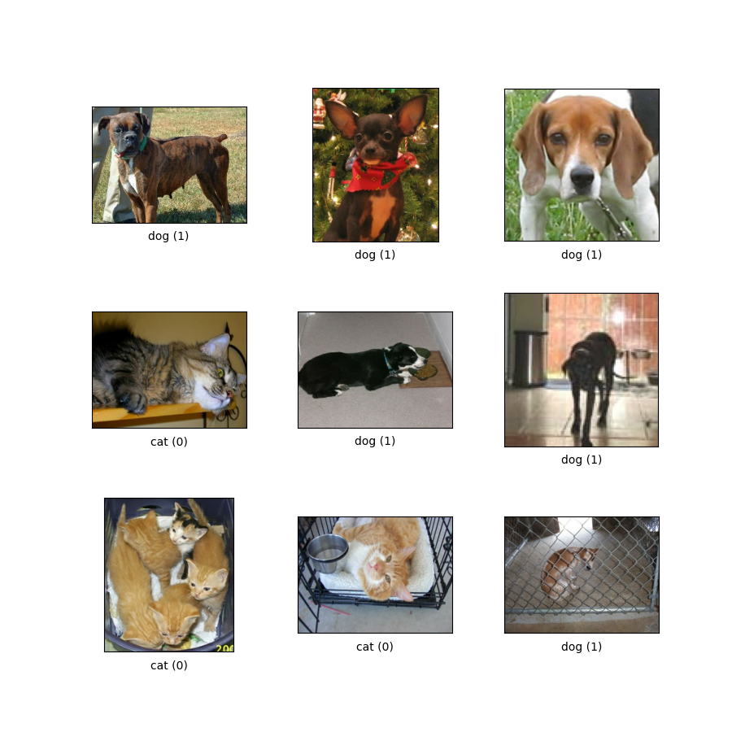

<h1 align="center">Dogs vs Cats Image Classification using ResNet34</h1>
<p align="center">
  
</p>
<p align="center">
  <em>An image classification project using a pre-trained ResNet34 model to differentiate between dogs and cats.</em>
</p>


This project aims to classify images as either dogs or cats using a pre-trained ResNet34 model in PyTorch.  
The model achieves over 96% accuracy on a dataset containing thousands of images of cats and dogs from Kaggle.

## Installation
To run this project, make sure you have the following libraries installed:  

pip install kaggle  
pip install optuna  

## Environment
>This project is designed to run on Google Colab, a free Jupyter notebook environment provided by Google.

## Functions
### load_data()
>This function is responsible for loading the data and preparing it for training.  
>It provides train_loader, valid_loader, and test_loader for training, validation, and testing, respectively.

### train_model()
  Trains the ResNet34 model on the provided dataset.

### validate_model()
>Validates the trained model.

### evaluate_accuracy()
>Calculates the accuracy of the trained model.

### evaluate_loss()
>Calculates the loss of the trained model.

### evaluate_model()
>Evaluates the trained model, including accuracy, precision, and recall. Additionally, it plots the confusion matrix and the ROC curve.

### predict()
>Uses the trained model to predict classes from the test_loader.

## How to Use
Ensure the necessary libraries are installed as mentioned in the Installation section.  
Set up a Google Colab environment.  
Import the necessary modules and functions.  
Use load_data() to prepare the data.  
Train the model using train_model().  
Validate the model using validate_model().  
Evaluate the model using evaluate_model().  
Use predict() to predict classes from the test data.  

# Example:
```from your_module import load_data, train_model, validate_model, evaluate_model, predict

train_loader, valid_loader, test_loader = load_data()

train_model(train_loader, valid_loader)

validate_model(test_loader)

evaluate_model(test_loader)

predictions = predict(test_loader)
